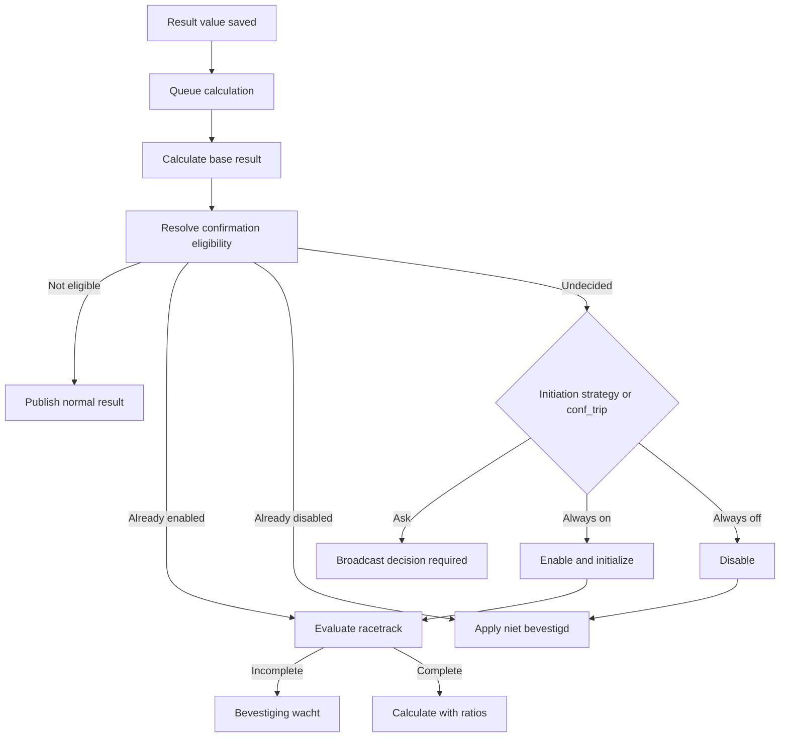

# Confirmation Migration and Implementation Plan

## Purpose

This document is the implementation specification for transplanting the legacy confirmation workflow into the current Laravel 13, Vue 3, Pinia, and Reverb application.

The implementation may refactor the behavior into actions, models, resources, and Vue components, but it must remain compatible with the existing database rows and legacy column names. Existing confirmation data must be readable by both the legacy representation and the new application.

The target is a complete confirmation workflow up to the boundary where individual calculation classes consume confirmation state and ratios for final result generation. Assurance form behavior is explicitly deferred; its fields must remain visible placeholders and must not make a confirmation impossible to finish.

## Executive Decisions

1. Keep the legacy `assays`, `sampleanalysis`, `confirmations`, `confirmationtables`, and `confkeystore` table and column names.
2. Keep `sampleanalysis.conf_requested` as the persisted three-state decision field. It is not a boolean.
3. Add a `Confirmation` Eloquent model and a `SampleAnalysis::confirmationRecord()` relationship. Do not normalize racetrack JSON into new relational tables during this port.
4. Centralize confirmation state and readiness in backend actions. Calculators may consume confirmation ratios, but must not independently decide whether the workflow is pending, enabled, or disabled.
5. Emit the ask decision through a Reverb event after a result calculation identifies an eligible result. The API remains the source of truth; the event is only a real-time prompt signal.
6. Replace the legacy HTML-generating controller and full-modal refresh cycle with JSON resources, a dedicated Pinia store, and Vue components.
7. Keep global and per-plate confirmation modes. A global scope is stored as `global/0`; a plate scope uses the legacy result `df/rep` keys.
8. When confirmation is disabled by decision, return the calculated result with the addendum `niet bevestigd`.
9. When confirmation is enabled but incomplete, the visible end result is `Bevestiging wacht` and `sampleanalysis.is_ready` is false.
10. Preserve old JSON key shapes. Runtime confirmation JSON must be encoded as objects, including numeric-looking keys, in the same style as `JSON_FORCE_OBJECT`.

## Current Application Baseline

The Laravel application already contains part of the required compatibility surface:

- `app/Models/Assay.php` exposes all legacy assay columns, including `confirmation`, `confirmation_type`, `confirmation_script`, `confirmation_support`, `confirmation_init`, `confirmation_depth`, and `show_conf_table`.
- `database/migrations/2026_09_07_130000_create_assay_administration_tables.php` creates those assay columns and the confirmation-related media columns.
- `app/Models/SampleAnalysis.php` exposes `conf_requested` and `is_ready`.
- `database/migrations/2026_09_10_020000_create_sample_analysis_tables.php` creates both fields with legacy names and defaults.
- `app/Models/AssayProfile.php` and the research profile editor already preserve `conf_trip`.
- `resources/views/assays/edit.blade.php` currently exposes the confirmation settings, but `confirmation_script` and `confirmation_support` are raw textareas.
- `resources/views/assays/create.blade.php` does not expose confirmation configuration; `app/Actions/Assays/CreateAssay.php` always creates a disabled confirmation configuration.
- `resources/js/components/SampleLookup.vue` contains a placeholder Bevestigingen button.
- `resources/js/stores/sampleLookupStore.js` already loads result rows, queues calculations, and consumes calculation events.
- `app/Actions/Results/CalculateAnalysisResult.php` currently writes the calculator's `isReady` directly to `sampleanalysis.is_ready`.
- `app/Calculations/ResultCalculationCache.php` includes basic assay confirmation flags in its hash, but not `conf_requested`, confirmation JSON, `confirmation_script`, `confirmation_support`, `confirmation_init`, or `confirmation_depth`.
- `app/Support/PermissionCatalog.php` already defines `confirmations.reset`.
- `routes/channels.php` and `resources/js/components/SampleLookup.vue` already use the private `samples.{sampleId}` Reverb channel.

The modern application does not yet have:

- a migration or model for `confirmations`, `confirmationtables`, or `confkeystore`;
- a confirmation controller, requests, resources, actions, or policy;
- typed server-side validation of assay confirmation JSON;
- a Vue assay confirmation editor;
- a confirmation viewer or Pinia store;
- confirmation-aware calculation readiness and cache invalidation;
- the Reverb event for an analyst decision;
- confirmation feature tests.

There is also a nearby routing gap to resolve while implementing this feature: `resources/views/samples/lookup.blade.php` references the named route `sample-analyses.calculate`, and `ResultController::calculate()` exists, but the route is not currently declared in `routes/web.php`.

## Legacy Source Map

The controlling legacy implementation is spread across these files:

| Concern | Legacy source |
| --- | --- |
| Assay fields and persistence | `legacy/app/controllers/assaysController.php` |
| Assay editor widget and JSON serialization | `legacy/app/views/assays/edit.php` |
| Confirmation editor rows and media filtering | `legacy/app/controllers/mediaController.php` |
| Confirmation record, racetrack, metadata, and readiness | `legacy/app/controllers/confirmationsController.php` |
| Result edit trigger and ask/auto decision | `legacy/app/controllers/resultsController.php` |
| Decision persistence and reset | `legacy/app/controllers/sampleAnalysisController.php` |
| Result-entry prompt, modal, save queue, and buttons | `legacy/app/views/samples/lookup.php` |
| Viewer markup and assurance-form behavior | `legacy/app/views/confirmations/confirmationViewer.php` |
| Shared calculation readiness | `legacy/app/shared/calculation.class.php` |
| Assay-specific confirmation result behavior | `legacy/app/private/templateScripts/*.class.php` |
| Exact legacy schema | `legacy/app/sql_legacy.sql` |

## Terminology and Persisted States

Two different integer fields use the same values for different concepts. They must not share one enum.

### Assay initiation strategy: `assays.confirmation_init`

| Value | Meaning | Required behavior |
| --- | --- | --- |
| `0` | Ask | Emit a decision-required event when a calculated result qualifies. |
| `1` | Always on | Automatically set `conf_requested=1` and initialize confirmation. |
| `2` | Always off | Automatically set `conf_requested=2`; final result gets `niet bevestigd`. |

The legacy Dutch option labelled `Ja` means "yes, ask". Use unambiguous labels in the new editor: `Vragen`, `Standaard aan`, and `Standaard uit`.

### Analysis decision: `sampleanalysis.conf_requested`

| Value | Meaning | Confirmation row | Result behavior |
| --- | --- | --- | --- |
| `0` | Undecided | Usually absent | Await a decision only when the calculated result qualifies. |
| `1` | Enabled | Required | Wait until the applicable racetrack scopes are complete. |
| `2` | Disabled by user or rule | Absent | Use the base calculated result and add `niet bevestigd`. |

Do not rename or convert this field to a boolean. Use constants or a backed enum at action boundaries while keeping the persisted integer and JSON response value.

### Derived workflow status

Expose a derived status instead of making the frontend infer state from several fields:

| Status | Derivation | UI/result |
| --- | --- | --- |
| `not_applicable` | Assay does not use confirmation, or the result is exempt | Normal result |
| `decision_pending` | Confirmation applies, result qualifies, `conf_requested=0` | Decision dialog; not ready |
| `enabled_pending` | `conf_requested=1`, row absent or `isReady=0` | `Bevestiging wacht`; not ready |
| `enabled_complete` | `conf_requested=1`, `confirmations.isReady=1` | Final confirmation-adjusted result |
| `disabled` | `conf_requested=2` | Base result plus `niet bevestigd` |

This derived state resolves a legacy ambiguity: `conf_requested=0` can mean either "no decision needed for this result" or "waiting for an answer". Eligibility from the calculation distinguishes those cases without changing stored data.

## Legacy Database Contract

### `confirmations`

Create this table with the legacy names and without timestamps:

| Column | Legacy type | Meaning |
| --- | --- | --- |
| `said` | integer | Logical reference to `sampleanalysis.id` |
| `note` | text nullable | Free confirmation note |
| `in_use` | text nullable | Media activation map by scope |
| `racetrack` | text not null | Contenders and chain answers |
| `metadata` | text not null | Scope readiness, ratios, dates, and users |
| `isReady` | integer default 0 | Aggregate readiness across all scopes |
| `data` | text not null | Obsolete payload retained for compatibility; store `{}` |
| `id` | unsigned integer primary key | Legacy primary key |

Keep the legacy indexes on `said` and `id,said`. The old schema does not enforce one row per SAID, although all application code assumes one. During import, detect and report duplicate `said` values. Do not silently merge them. Once production data is clean, a unique index can be considered in a later optimization.

### `confirmationtables`

The optional `assays.show_conf_table` setting points to legacy administrator-authored reference HTML:

| Column | Type |
| --- | --- |
| `id` | integer primary key |
| `name` | text nullable |
| `html` | text nullable |

Preserve this table if old assay configurations reference it. Render its content only through an explicit sanitization boundary. Do not execute embedded scripts.

### `confkeystore`

The legacy control-value cache uses:

| Column | Meaning |
| --- | --- |
| `innocdate` | Inoculation date string used as part of the lookup key |
| `media` | `media.id` |
| `param` | `poscontrol`, `negcontrol`, or `blankcontrol` |
| `value` | Stored control value |
| `id` | Primary identifier in application use, although the legacy SQL only indexes it |

This is separate from assurance forms. Implement it if confirmation media use controls. A robust implementation should treat `(innocdate, media, param)` as the logical key, lock matching rows, and update-or-create deterministically. Do not add a database uniqueness constraint until imported duplicates have been audited.

### Model mapping

Add:

- `app/Models/Confirmation.php`
- `app/Models/ConfirmationTable.php`
- `app/Models/ConfKeyStore.php`
- `SampleAnalysis::confirmationRecord(): HasOne`, foreign key `said`
- `Confirmation::sampleAnalysis(): BelongsTo`, foreign key `said`

All three models use `$timestamps = false`.

Cast `isReady` to boolean. Do not use Laravel's plain `array` cast for writes to `in_use`, `racetrack`, or `metadata`, because a sequential PHP array may be serialized as `[]`. Add a small custom cast/value serializer that decodes both old arrays and objects but always encodes runtime confirmation payloads with `JSON_FORCE_OBJECT | JSON_THROW_ON_ERROR`.

Do not model `confirmation_script` media IDs as a normal Eloquent relation. They are ordered references inside legacy JSON. Parse them into a DTO and bulk-load all referenced `Media` rows in one query.

## JSON Compatibility Contract

### Assay chain: `assays.confirmation_script`

```json
[
  {"mediaId": 5, "chainId": 1, "disposition": "+"},
  {"mediaId": 12, "chainId": 2, "disposition": "-"},
  {"mediaId": 8, "chainId": 3, "disposition": "?"}
]
```

Rules:

- Array order is authoritative.
- `chainId` is one-based and must be regenerated as contiguous `1..n` after reorder or removal.
- `mediaId` must reference an existing medium. Existing inactive media must remain editable on historical assay revisions.
- `disposition` is exactly `+`, `-`, or `?`.
- Duplicate media IDs must not be rejected during the compatibility port; the chain index separates repeated use.

### Supporting media: `assays.confirmation_support`

```json
[
  {"mediaId": 10, "chainId": 1}
]
```

The ordering and one-based contiguous `chainId` rules are the same. Legacy selectable support entries include confirmation media and type `3` material rows.

### Global runtime payload

```json
{
  "racetrack": {
    "global": {
      "0": {
        "0": {"0": "+", "1": ""},
        "1": {"0": "-", "1": null}
      }
    }
  },
  "metadata": {
    "global": {
      "0": {
        "isReady": false,
        "ratio": false,
        "0": {
          "5_inzet": "12-09-2026",
          "5_inzet_user": 7,
          "5_aflees": ""
        }
      }
    }
  },
  "in_use": {
    "global": {
      "0": {"5": true, "12": true, "10": false}
    }
  }
}
```

### Per-plate runtime payload

```json
{
  "racetrack": {
    "0.1": {
      "0": {"0": {"0": "+", "1": "+"}},
      "1": {"0": {"0": "+", "1": ""}}
    }
  }
}
```

Path meanings:

- `racetrack[df][rep][contender][stepIndex] = answer`
- `metadata[df][rep]['isReady'] = boolean`
- `metadata[df][rep]['ratio'] = confirmed / tested`, or `false` while unavailable
- `metadata[df][rep][stepIndex][fieldName] = value`
- `metadata[df][rep][stepIndex][fieldName + '_user'] = user id`
- `in_use[df][rep][mediaId] = boolean`

Dates are stored in the legacy `d-m-Y` display format. Do not silently rewrite imported date strings. The API may expose an additional ISO-normalized value for date inputs, but persisted compatibility values must remain stable until a dedicated migration is approved.

## Legacy Admin Editor and Vue Replacement

### Legacy behavior

The legacy assay edit page loads two server-rendered widgets through AJAX:

1. The confirmation chain lists media flagged with `media.confirmation_media=1`.
2. Each chain row contains its sequence number, media, media type, expected disposition, and remove action.
3. The support list allows confirmation media plus type `3` materials.
4. Adding, removing, or changing rows serializes the whole table into hidden `confirmation_script` or `confirmation_support` textareas.
5. Sequence numbers are recalculated from DOM order.

The modern edit page currently falls back to raw JSON textareas, and the create page has no confirmation section. Both must use the same Vue editor.

### Target component

Create `resources/js/components/AssayConfirmationEditor.vue` and mount it from both assay create and edit views.

Suggested props:

```js
{
    enabled: Boolean,
    type: Number,
    initiation: Number,
    depth: Number,
    script: Array,
    support: Array,
    media: Array,
    confirmationTables: Array,
    selectedTable: String | Number | null,
    disabled: Boolean,
}
```

Suggested local shape:

```js
{
    enabled: false,
    mode: 1,
    initiation: 0,
    depth: 5,
    steps: [{ key: crypto.randomUUID(), mediaId: 5, disposition: '+' }],
    support: [{ key: crypto.randomUUID(), mediaId: 10 }],
    confirmationTable: null,
}
```

`key` is UI-only and must never be persisted. Generate `chainId` from the current array index at serialization time.

The component should provide:

- a checkbox for whether confirmation is used;
- a segmented control for global versus per-plate mode;
- a select for ask/always on/always off;
- a numeric contender-depth input;
- an ordered chain list with media selector, disposition select, move-up, move-down, and remove icon buttons;
- an ordered support-media list with the same movement controls but no disposition;
- an optional confirmation-table select;
- compact validation errors next to the affected controls;
- hidden form inputs containing serialized legacy JSON and scalar settings.

Use Lucide icons for movement and removal. Reuse the search/filter interaction from `resources/js/components/MediaSelector.vue`, but do not couple the chain to the assay's normal `media_id` selection: confirmation media are a separate legacy list.

When an old revision references inactive media, include those media in the prop payload and mark them inactive instead of dropping the rows. This mirrors the existing edit behavior for normal assay media.

### Backend validation

Replace the current string-only rules in `UpdateAssayRequest` with structure-aware validation. The browser should never be the only validator.

The request may still submit JSON strings for compatibility with the Blade form, but `prepareForValidation()` or a dedicated normalizer should decode them before validating:

- `confirmation`: boolean
- `confirmation_type`: `0` or `1`
- `confirmation_init`: `0`, `1`, or `2`
- `confirmation_depth`: nullable integer, minimum `0`
- `confirmation_script`: array
- `confirmation_script.*.mediaId`: existing media ID
- `confirmation_script.*.chainId`: integer; ignore the submitted number and regenerate it
- `confirmation_script.*.disposition`: `+`, `-`, or `?`
- `confirmation_support`: nullable array
- `confirmation_support.*.mediaId`: existing media ID

The save action must encode the normalized arrays into the existing text columns. Preserve historical raw values when an unrelated field on an older revision is edited and the confirmation payload was not submitted.

Extend `StoreAssayRequest`, `CreateAssay`, and `resources/views/assays/create.blade.php`; otherwise newly created assays cannot configure confirmation even after the edit component exists.

## Result Entry Integration

### Placement

Global mode (`confirmation_type=0`):

- Show one confirmation status/action next to the end-result panel.
- Opening it always selects scope `{df: 'global', rep: 0}`.
- The racetrack contender count is based on the sum of applicable counts across the analysis, capped by `confirmation_depth`.

Per-plate mode (`confirmation_type=1`):

- Show a confirmation action on each result row or dilution/replicate block in `SampleLookupResults.vue`.
- Pass the row's exact persisted `df` and `rep` values.
- Hide or mark the action not applicable when that plate's `kve` is exactly `0` or `>`; legacy automatically marks those scopes ready and removes their active media/racetrack scope.

Do not use a single generic confirmation button for per-plate mode. The analyst must be able to see which dilution and replicate is pending.

### Result API additions

Extend `GetAnalysisResults` so the response contains enough state to render controls without a second waterfall request:

```json
{
  "confirmation": {
    "configured": true,
    "mode": "per_plate",
    "decision": 1,
    "status": "enabled_pending",
    "decision_required": false,
    "global_ready": false,
    "scopes": {
      "0.1:0": {"df": "0.1", "rep": 0, "ready": true, "applicable": true},
      "0.1:1": {"df": "0.1", "rep": 1, "ready": false, "applicable": true}
    }
  }
}
```

Keep `conf_requested` in the lookup analysis payload for compatibility, but make the nested confirmation object the UI contract.

## Confirmation Initiation and Reverb

### Trigger point

The legacy application decides whether to ask only after recalculating the end result. It examines the calculated `kve` and disposition, not just the raw field that changed. Preserve that ordering:



Add an action such as `App\Actions\Confirmations\ResolveConfirmationDecision`. It receives the locked analysis and the base calculation result and returns a derived workflow state plus any state transition to apply.

### Eligibility and profile threshold

Preserve these legacy rules:

- An assay must have `confirmation=1`.
- Empty/incomplete calculations do not prompt.
- Results considered negative/non-confirmable by the calculator do not prompt. Legacy examples include numeric zero and negative disposition.
- A roaming/loose analysis (`profile=0`) follows `confirmation_init` directly.
- A profile analysis with `assayprofiles.conf_trip=0` follows `confirmation_init`.
- A profile analysis with `conf_trip>0` automatically enables when the calculated numeric trigger is greater than the threshold and automatically disables otherwise.
- A meta calculator may target the parent meta analysis rather than the analysis whose result changed. Represent this explicitly as `target_analysis_id` in the calculation's confirmation trigger contract.

Do not copy the legacy `preg_replace('/[^0-9]/', '', $kve)` parsing into controllers. Add an optional structured calculator result:

```php
'confirmationTrigger' => [
    'eligible' => true,
    'numericValue' => 1250.0,
    'disposition' => '+',
    'targetAnalysisId' => $context->analysis->id,
],
```

During calculator migration, a small legacy-compatible fallback parser may be used only for calculators that have not yet emitted this structure. Cover every fallback with fixtures before replacing it.

### Event contract

Create `App\Events\ConfirmationDecisionRequired`:

- broadcast on the existing private `samples.{sampleId}` channel;
- use the stable event name `analysis.confirmation.decision-required`;
- expose only `sample_id`, `analysis_id`, `assay_name`, `mode`, and a short prompt message;
- do not include the complete racetrack or sensitive model payload;
- dispatch after calculation and database state are committed.

The existing calculation job calls the calculation action and broadcasts only after that action's transaction returns. The decision-required event can follow the same pattern. If an event is dispatched from inside a transaction instead, implement after-commit dispatch semantics.

The sample channel reaches authorized analysts currently viewing that sample. There is no analyst-owner relation in the current schema, so a user-specific channel would invent ownership semantics. The frontend must filter by selected analysis and queue prompts for other analyses in the loaded sample.

### Reliable prompt behavior

Reverb delivery is not durable. Therefore:

- the GET results/confirmation response must include `decision_required`;
- the event opens the prompt immediately when the target analysis is selected;
- missed events are recovered on reload from server state;
- the store deduplicates prompts by `analysis_id`;
- accepting or declining calls the decision endpoint, and the response replaces local state;
- reconnecting must not produce duplicate decisions.

## Decision Transitions

Create `App\Actions\Confirmations\SetConfirmationDecision` with these transitions:

| Command | Persisted value | Other writes |
| --- | --- | --- |
| `enable` | `conf_requested=1` | Create/reinitialize one confirmation row and its scopes. |
| `disable` | `conf_requested=2` | Delete the confirmation row, invalidate calculation cache, recalculate. |
| `reset` | `conf_requested=0` | Permission `confirmations.reset`; delete confirmation row and recalculate decision state. |

The legacy `setConfFlag()` deletes the confirmation row in both branches, including enable. That works only because a later read recreates it. Do not preserve this timing bug. Enable must atomically leave a valid initialized row.

Use one transaction and a consistent lock order:

1. lock `sampleanalysis`;
2. lock the project or verify its current lock/authorization status;
3. lock the existing `confirmations` row if present;
4. apply the state transition;
5. invalidate `storedResult` and dispatch recalculation after commit.

Read access requires `samples.view`. Mutating a decision or confirmation data should require the project's existing laboratory update permission, preferably `samples.update`. Reset additionally requires `confirmations.reset`. Every mutation must reject authorized or locked projects, matching `sampleLookupStore.readOnly`.

## Racetrack Rules

### Scope initialization

Create `InitializeConfirmation` and `SynchronizeConfirmationScopes` actions.

For global mode:

- scope is always `df='global'`, `rep=0`;
- contender count is the sum of the `kve` values over all result rows;
- a `+` source value historically acts as a large positive count;
- cap the initial count at `confirmation_depth`.

For per-plate mode:

- create one scope per current result row using its persisted `df` and `rep`;
- contender count is that row's `kve` count capped at `confirmation_depth`;
- mark a scope ready and omit its racetrack when `kve` is exactly `0` or `>`;
- when result rows are added or removed, add missing scopes and remove stale `metadata`, `racetrack`, and `in_use` branches.

The legacy meta mode counts across related assay revisions and takes the maximum total by child SAID. Isolate that behavior in a `DetermineConfirmationContenderCount` action so normal and meta counting can be tested separately.

An initial depth of zero is legal legacy data. Keep it readable and show a configuration warning; do not silently change imported assay settings.

### Track evaluation

Create a pure `EvaluateConfirmationRacetrack` service. Given the chain, contenders, relevant metadata, media configuration, and assurance availability, it returns:

- each contender's `active`, `finished`, and `confirmed` state;
- each step's `in_use` state;
- metadata requirements for reached steps;
- `tested`, `confirmed`, and `ratio`;
- scope readiness and aggregate readiness.

For each contender, evaluate steps in order:

1. Empty answer: contender is unfinished and no later step is active.
2. Required `+` or `-` answer matches: continue to the next step.
3. Required answer does not match and is non-empty: contender is finished but not confirmed; later answers are set to `null`.
4. `?` with an empty answer: contender is unfinished.
5. `?` with either non-empty answer: continue; the visual success/error color may reflect `+`/`-`, but either answer satisfies the optional branch.
6. Reaching the final step through matching/optional answers: contender is finished and confirmed.

A scope is ready when every contender is finished and all required metadata for reached media is complete. It is valid for a ready scope to have ratio `0`.

The ratio is:

$$
\text{confirmation ratio} = \frac{\text{confirmed contenders}}{\text{tested contenders}}
$$

Avoid division by zero. A zero-contender scope must follow an explicit applicability rule; it must not become ready accidentally because an empty collection passes an `all()` check.

### Metadata

For every chain step reached by at least one active contender, legacy readiness requires:

- `{mediaId}_inzet`;
- `{mediaId}_aflees`;
- configured positive, negative, and blank controls from `confkeystore`;
- THT when `media.hasDate=1` through assurance forms.

Persist direct metadata values under `metadata[df][rep][stepIndex]` and persist `{fieldName}_user` beside each changed value. Controls remain in `confkeystore`, matching legacy behavior.

The old controller recalculates readiness while rendering the viewer, so a GET mutates the database. Do not preserve that defect. Every mutation action must save the value and run the evaluator in the same transaction. GET endpoints are read-only.

### `in_use`

For chain media, `in_use` is derived: it is true when at least one contender reaches that step. Recompute it during evaluation rather than trusting client input.

For supporting media, `in_use` is user-controlled. Keep those booleans separate in the action input, then serialize them back into the same legacy `in_use[df][rep][mediaId]` map.

### Add and remove contender

- Adding creates one contender with one empty value per current chain step.
- Manual additions are not capped in legacy; preserve that behavior unless product owners explicitly choose a new limit.
- Removing reindexes all remaining contenders from zero. This is data-critical because the UI and calculators assume contiguous numeric keys.
- Both operations immediately reevaluate the scope and invalidate the calculation cache.

## Assurance Form Placeholder Boundary

The following legacy fields depend on assurance forms and are not implementable yet:

- medium THT value;
- support-medium THT/material value;
- out-of-date state and explanation button/modal;
- automatic expiry comparison against the inoculation date.

The confirmation resource should still return placeholder descriptors for these fields:

```json
{
  "key": "5_tht",
  "kind": "assurance_placeholder",
  "available": false,
  "required": false,
  "value": null
}
```

Render them in the expected table position as disabled fields. Until assurance forms are implemented, unavailable placeholders must be excluded from metadata completeness. Otherwise every medium with `hasDate=1` would permanently block the racetrack.

Inzet date, aflees date, and `confkeystore` controls are not assurance-form placeholders and should be implemented now. Supporting media can be activated and displayed, but their unavailable value/THT input remains disabled and does not block readiness.

Put the boundary behind an interface such as `ConfirmationAssuranceFields`. The initial implementation returns unavailable descriptors; the future assurance module can supply values and required-state checks without changing the Vue resource contract.

## HTTP API

Use nested routes under the existing sample-analysis result routes:

| Method | Route | Action |
| --- | --- | --- |
| `GET` | `/laboratory/sample-analyses/{sampleAnalysis}/confirmation` | Return config, decision, scopes, selected scope, chain, metadata, support, and summary. |
| `PATCH` | `/laboratory/sample-analyses/{sampleAnalysis}/confirmation/decision` | Enable, disable, or reset. |
| `PATCH` | `/laboratory/sample-analyses/{sampleAnalysis}/confirmation/track` | Save one contender step. |
| `PATCH` | `/laboratory/sample-analyses/{sampleAnalysis}/confirmation/metadata` | Save one metadata/control field. |
| `PATCH` | `/laboratory/sample-analyses/{sampleAnalysis}/confirmation/support` | Toggle one support medium. |
| `POST` | `/laboratory/sample-analyses/{sampleAnalysis}/confirmation/contenders` | Add a contender to a scope. |
| `DELETE` | `/laboratory/sample-analyses/{sampleAnalysis}/confirmation/contenders/{contender}` | Remove and reindex a contender. |
| `PATCH` | `/laboratory/sample-analyses/{sampleAnalysis}/confirmation/note` | Save the note. |

Use route model binding for `SampleAnalysis`. Validate that any supplied scope belongs to its result matrix and that the requested mode agrees with the assay; never trust a client-supplied `globalConf` flag.

Every mutation returns the same authoritative confirmation resource. The Vue store can replace its selected scope without issuing a separate refresh request.

Suggested resource shape:

```json
{
  "data": {
    "analysis_id": 42,
    "decision": 1,
    "status": "enabled_pending",
    "read_only": false,
    "config": {
      "mode": "global",
      "depth": 5,
      "steps": [
        {"index": 0, "chain_id": 1, "media_id": 5, "name": "BCYE", "disposition": "+"}
      ]
    },
    "selected_scope": {"df": "global", "rep": 0},
    "scopes": [{"df": "global", "rep": 0, "ready": false, "applicable": true}],
    "contenders": [
      {"index": 0, "finished": false, "confirmed": false, "answers": {"0": ""}}
    ],
    "metadata_fields": [],
    "support_fields": [],
    "summary": {"tested": 1, "confirmed": 0, "ratio": null, "scope_ready": false, "all_ready": false},
    "note": ""
  }
}
```

Use dedicated Form Requests with scalar allowlists. In particular, validate `df` as a string matching an existing result value rather than coercing it to a float; `0.1` must remain a stable JSON key.

## Backend File Plan

Suggested additions:

```text
app/Actions/Confirmations/
  AddConfirmationContender.php
  GetConfirmation.php
  InitializeConfirmation.php
  RecalculateConfirmation.php
  RemoveConfirmationContender.php
  ResolveConfirmationDecision.php
  SetConfirmationDecision.php
  SetConfirmationSupportMedium.php
  SynchronizeConfirmationScopes.php
  UpdateConfirmationMetadata.php
  UpdateConfirmationTrackValue.php
app/Confirmations/
  ConfirmationAssuranceFields.php
  ConfirmationRacetrackEvaluator.php
  ConfirmationState.php
  PendingConfirmationAssuranceFields.php
app/Events/
  ConfirmationDecisionRequired.php
  ConfirmationUpdated.php
app/Http/Controllers/
  ConfirmationController.php
app/Http/Requests/Confirmations/
  AddConfirmationContenderRequest.php
  SetConfirmationDecisionRequest.php
  UpdateConfirmationMetadataRequest.php
  UpdateConfirmationNoteRequest.php
  UpdateConfirmationSupportRequest.php
  UpdateConfirmationTrackRequest.php
app/Http/Resources/
  ConfirmationResource.php
app/Models/
  Confirmation.php
  ConfirmationTable.php
  ConfKeyStore.php
```

Keep controllers limited to authorization, validated input, action invocation, and resource responses. Shared evaluation belongs in a pure service because it is used by field updates, result-row synchronization, initialization, and calculation.

## Vue and Pinia Plan

### Components

Add:

- `AssayConfirmationEditor.vue`: complete administration editor used by assay create and edit forms.
- `ConfirmationDialog.vue`: modal shell, scope tabs, summary, note, and save/error state.
- `ConfirmationRacetrack.vue`: stable grid containing steps, contenders, and metadata columns.
- `ConfirmationDecisionDialog.vue`: ask-mode accept/decline prompt.

Do not nest decorative cards. The racetrack should be a horizontally scrollable data grid with sticky media labels and stable column widths. On narrow screens, keep the scope selector and summary visible while allowing the grid itself to scroll.

Use select/radio controls for `+` and `-` rather than accepting arbitrary text. Use native date inputs in the UI where possible, converting only at the API compatibility boundary. Disable all mutation controls when the project is locked or authorized.

### Dedicated store

Create `resources/js/stores/confirmationStore.js` with state similar to:

```js
state: () => ({
    endpoint: '',
    analysisId: null,
    data: null,
    selectedScopeKey: null,
    loading: false,
    mutations: {},
    error: '',
    decisionPrompt: null,
    requestRevision: 0,
})
```

Required actions:

- `configure(endpoints)`
- `load(analysisId, scope)`
- `setDecision(decision)`
- `saveTrackAnswer(contender, step, value)`
- `saveMetadata(field, value)`
- `toggleSupport(mediaId, active)`
- `addContender()`
- `removeContender(index)`
- `saveNote(note)`
- `applyUpdatedEvent(event)`
- `queueDecisionPrompt(event)`
- `reset()`

Use mutation keys such as `track:0:2` and `metadata:5_inzet` so one input can save without disabling the entire dialog. Keep a request revision to ignore stale responses when the selected analysis or scope changes. The server response replaces local readiness, ratio, `in_use`, and downstream answers.

The old JavaScript needed a global serial queue because every save caused a complete HTML rerender. The new store should serialize mutations for the same confirmation row, while allowing the UI to remain stable. Do not rely on response order; chain a per-analysis promise or reject stale revisions.

### Reverb listeners

Extend the existing `samples.{sampleId}` subscription in `SampleLookup.vue`:

```js
.listen('.analysis.confirmation.decision-required', event => confirmationStore.queueDecisionPrompt(event))
.listen('.analysis.confirmation.updated', event => confirmationStore.applyUpdatedEvent(event))
```

`ConfirmationUpdated` is useful when two analysts have the same sample open. Broadcast a compact new resource or a revision/hash and let other clients reload. For mutations initiated through `fetch`, include `X-Socket-ID` if using `toOthers()`; otherwise accept and deduplicate the sender's event.

## Calculation and End-Result Contract

### Separate three concerns

The final readiness decision must distinguish:

1. `calculation_ready`: all required result inputs are present and the numeric/domain calculation succeeded;
2. `confirmation_status`: not applicable, decision pending, enabled pending, enabled complete, or disabled;
3. `isReady`: final authorization readiness after applying confirmation policy.

Add a coordinator such as `ApplyConfirmationWorkflowToResult` after the calculator returns and before `storedResult` is saved.

Recommended result payload additions:

```php
[
    'output' => [...],
    'draftOutput' => [...],
    'addenda' => [],
    'calculationReady' => true,
    'confirmation' => [
        'status' => 'enabled_pending',
        'decision' => 1,
        'ready' => false,
        'ratios' => ['global' => ['0' => 0.5]],
    ],
    'isReady' => false,
]
```

Policy:

| Condition | Visible output | Addenda | Final `isReady` |
| --- | --- | --- | --- |
| Base calculation incomplete | Calculator's incomplete output | none | false |
| Confirmation not applicable | Base output | calculator addenda | base readiness |
| Decision required | Base output or a dedicated decision status | none | false |
| Enabled, racetrack incomplete | `Bevestiging wacht` | none | false |
| Enabled, racetrack complete | Confirmation-aware calculator output | calculator addenda | base readiness |
| Disabled | Base output | append `niet bevestigd` | base readiness |

Use a structured addendum item, for example `['code' => 'not_confirmed', 'label' => 'niet bevestigd']`, and let report/UI renderers decide presentation. Do not make new calculators append raw `<sup>**</sup>` themselves. A legacy report adapter can translate the code to `**` where required.

The existing `EndResultDisplay.vue` can render the waiting text and addenda once the payload is extended. It should not infer confirmation status from `isReady` alone.

### Confirmation data in calculator context

Extend `ResultCalculationContext` with an immutable confirmation snapshot rather than passing the Eloquent confirmation model into every calculator. The snapshot should contain:

- decision and derived status;
- global/per-plate mode;
- aggregate readiness;
- ratios by exact `df` and `rep` keys;
- enabled media IDs;
- a read-only normalized metadata view.

Calculators that do not use confirmation ignore it. Confirmation-aware calculators can apply a ratio only when the snapshot is complete. This keeps database mutation and workflow transitions outside calculation classes.

### Cache invalidation

Update `ResultCalculationCache` to include:

- `sampleanalysis.conf_requested`;
- a stable hash of confirmation `racetrack`, `metadata`, `in_use`, and `isReady`;
- `assays.confirmation_script` and `confirmation_support`;
- `assays.confirmation_init` and `confirmation_depth`.

Every confirmation mutation must clear or supersede `storedResult` and queue `CalculateAnalysisResultJob` after commit. Otherwise a completed racetrack can continue showing `Bevestiging wacht`, or a disabled confirmation can continue showing a result without its addendum.

## Compatibility Versus Legacy Defects

Preserve:

- table and column names;
- `conf_requested` integer meanings;
- global key `global` and replicate key `0`;
- per-plate `df/rep` key hierarchy;
- zero-based contender and step indexes in runtime JSON;
- one-based `chainId` in assay configuration;
- `+`, `-`, `?`, empty string, and downstream `null` semantics;
- contender reindexing after removal;
- metadata `_user` fields;
- ratio semantics;
- profile `conf_trip` behavior;
- old rows with `{}` or `[]` as empty JSON.

Fix during refactor:

- GET/render operations mutating readiness;
- enabling confirmation deleting its row and relying on a later read to recreate it;
- trusting arbitrary POST field names and client-supplied mode flags;
- parsing formatted result text with "remove every non-digit" logic;
- N+1 media queries in every chain render;
- duplicate ready calculation blocks in the viewer;
- full modal rerender after every field change;
- raw editable JSON textareas;
- duplicated dilution labels and other presentation-only errors;
- silent failure when JSON is malformed;
- coupling workflow status to individual calculation scripts.

Do not change during this port:

- legacy identifiers or imported values;
- the meaning of an already stored ratio;
- whether a failed contender counts as tested;
- the fact that all contenders may finish with ratio zero;
- support-media activation values, even though support does not currently block readiness.

## Implementation Order

### Phase 1: Persistence and parsing

1. Add exact-schema migrations for `confirmations`, `confirmationtables`, and `confkeystore`.
2. Add models and `SampleAnalysis` relationships.
3. Add legacy JSON serializers/DTOs and fixture tests using real global and per-plate payloads.
4. Add indexes only where they match legacy or are proven safe for imported data.

Exit criterion: imported confirmation rows round-trip without changing path semantics or converting required objects to arrays.

### Phase 2: Assay administration

1. Implement `AssayConfirmationEditor.vue`.
2. Use it from both create and edit views.
3. Add structure-aware request validation and action serialization.
4. Preserve inactive referenced media on old revisions.
5. Add confirmation-table selection if referenced legacy data exists.

Exit criterion: create and revise an assay, reload it, and obtain legacy-compatible JSON with contiguous chain IDs.

### Phase 3: Runtime API and evaluator

1. Implement the pure evaluator and fixture tests first.
2. Implement initialization and result-scope synchronization.
3. Implement field, note, support, and contender actions.
4. Add controller, requests, resource, routes, authorization, and audit hooks.
5. Return authoritative state from every mutation.

Exit criterion: global and per-plate rows can be loaded and completed entirely through JSON endpoints without render side effects.

### Phase 4: Vue racetrack

1. Implement the Pinia store and racetrack dialog.
2. Integrate global controls in the end-result area.
3. Integrate per-plate controls in result rows.
4. Add project lock/authorization handling and save errors.
5. Render assurance fields as non-blocking placeholders.

Exit criterion: an analyst can enable, fill, add/remove contenders, finish, disable, reset, and reopen confirmation without losing focus or state.

### Phase 5: Initiation and real-time flow

1. Add structured confirmation trigger data to calculation results.
2. Implement ask/always-on/always-off and `conf_trip` resolution.
3. Add decision-required and updated events.
4. Subscribe through the existing sample channel.
5. Recover pending prompts from GET state.

Exit criterion: a qualifying calculation reliably asks or auto-decides exactly once, including after refresh or temporary Reverb loss.

### Phase 6: Final result policy

1. Add the confirmation snapshot to calculation context.
2. Apply centralized waiting, disabled-addendum, and final readiness rules.
3. Include confirmation state in cache keys.
4. Update confirmation-aware calculators to consume ratios.
5. Add report adapters for the `not_confirmed` addendum.

Exit criterion: enabled/incomplete shows `Bevestiging wacht`; disabled shows the calculated result plus `niet bevestigd`; enabled/complete can feed ratios into migrated calculators.

## Required Tests

### Schema and compatibility

- Column order and names match `legacy/app/sql_legacy.sql`.
- Models use no timestamps or implicit renamed foreign keys.
- Legacy global and per-plate JSON fixtures decode and re-encode with object-shaped numeric keys.
- Empty `{}` and `[]` payloads are both accepted.
- Duplicate `said` rows are detected during import validation.

### Admin editor

- Existing chain/support JSON hydrates in the original order.
- Add, remove, and reorder regenerate contiguous `chainId` values.
- `+`, `-`, and `?` are accepted; other dispositions fail validation.
- Referenced inactive media survive revision.
- Malformed JSON and missing media IDs fail with useful errors.
- Create and update persist the same JSON contract.

### Decision state

- Ask mode broadcasts for an eligible positive calculation and remains `conf_requested=0` until answered.
- Always-on sets `1` and initializes atomically.
- Always-off sets `2` and does not create a confirmation row.
- `conf_trip=0` follows assay settings.
- `conf_trip>0` enables above the threshold and disables at or below it.
- Negative/exempt results do not prompt.
- Duplicate calculation jobs do not emit repeated active prompts.
- Reset requires `confirmations.reset`.

### Racetrack evaluator

- Empty required answer is unfinished.
- Matching required answer advances.
- Non-empty mismatch finishes as unconfirmed and nulls downstream answers.
- Empty optional answer is unfinished.
- Either non-empty optional answer advances.
- Active media and metadata requirements stop after a failed step.
- All contenders finished with none confirmed produces ratio `0` and ready state.
- Removing a contender reindexes remaining keys.
- Adding a contender initializes every configured step.
- Zero and `>` per-plate results are not applicable and become ready without a track.
- Global and per-plate aggregate readiness are correct.
- Unavailable assurance placeholders do not block readiness.

### HTTP and authorization

- Read endpoints require `samples.view`.
- Mutations reject locked and authorized projects.
- A result/scope from another analysis cannot be mutated.
- Client-supplied mode and arbitrary metadata paths are rejected.
- Every mutation returns updated summary and readiness.
- Concurrent updates serialize through row locks without losing unrelated fields.

### Calculation and UI

- Enabled incomplete confirmation stores and displays `Bevestiging wacht` with `isReady=false`.
- Disabled confirmation preserves the base value and adds `niet bevestigd`.
- Enabled complete exposes exact ratios to the calculator.
- Confirmation mutations invalidate cached calculations.
- The Vue store ignores stale responses after switching analyses/scopes.
- Reverb prompt events are deduplicated and missed prompts recover from GET state.
- Global controls render once; per-plate controls render for each applicable row.

Run focused backend tests through Sail, for example:

```bash
vendor/bin/sail artisan test --compact tests/Feature/Confirmations
vendor/bin/sail artisan test --compact tests/Unit/Confirmations
vendor/bin/sail bin pint --dirty --format agent
```

The repository has no npm test script at present. Run JavaScript tests with the project's established direct Node test command, or add a test script only as part of an approved frontend-test setup change. Run `vendor/bin/sail npm run build` for final Vue integration validation.

## Definition of Done

The confirmation transplant is complete when all of the following are true:

- Existing confirmation database rows load without migration-time rewriting.
- Assay create/edit uses a validated Vue chain editor rather than raw JSON.
- Ask, always-on, always-off, and profile threshold decisions work.
- Ask mode is delivered over Reverb and is recoverable without Reverb.
- Global and per-plate controls appear in their correct result-entry locations.
- The racetrack can initialize, edit, add/remove contenders, compute ratios, and reopen from persisted state.
- Assurance-dependent fields are present as non-blocking placeholders.
- Locked or authorized projects are read-only.
- Pending enabled confirmation displays `Bevestiging wacht` and is not ready.
- Disabled confirmation displays the base result with `niet bevestigd`.
- Completed confirmation exposes ratios to calculation classes and can produce a final ready result.
- Calculation caching changes whenever decision or confirmation data changes.
- Feature, unit, frontend, and build checks pass.

## Primary Risks

1. Numeric-looking JSON keys can silently become arrays if ordinary JSON casts are used. Test serialized shape, not only decoded equality.
2. The legacy code contains contradictory pending-decision readiness behavior. Use the explicit derived-state policy in this document rather than copying helper behavior piecemeal.
3. Reverb events can be missed. Never make the prompt event the only representation of a pending decision.
4. Calculation cache staleness can publish a result from before the latest confirmation edit.
5. Assurance-dependent fields would deadlock completion if they remain required while their backing module is absent.
6. Profile and meta-analysis triggers target different analyses. Carry `targetAnalysisId` explicitly and test both paths.
7. Old data may contain malformed JSON, inactive media references, sparse indexes, or duplicate confirmation rows. Add an audit command before production cutover; report anomalies instead of silently repairing them.